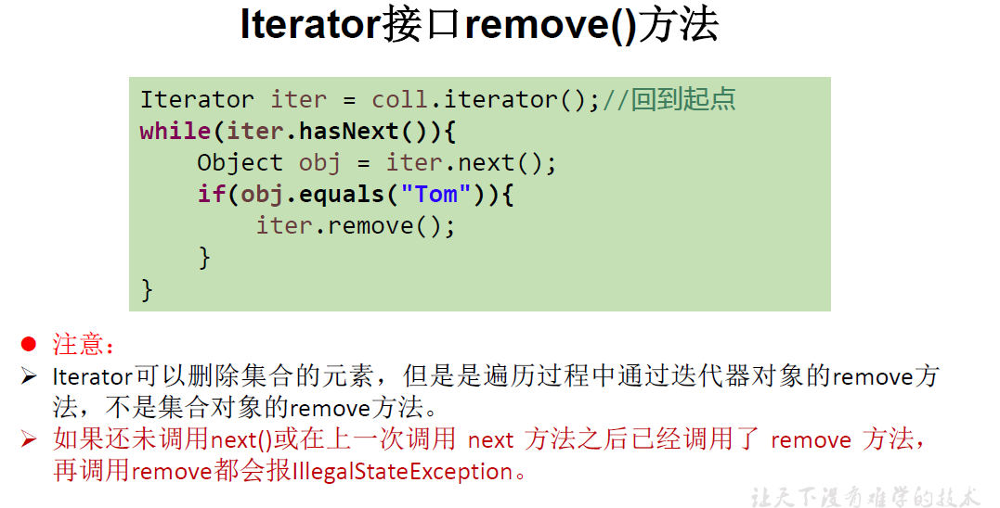
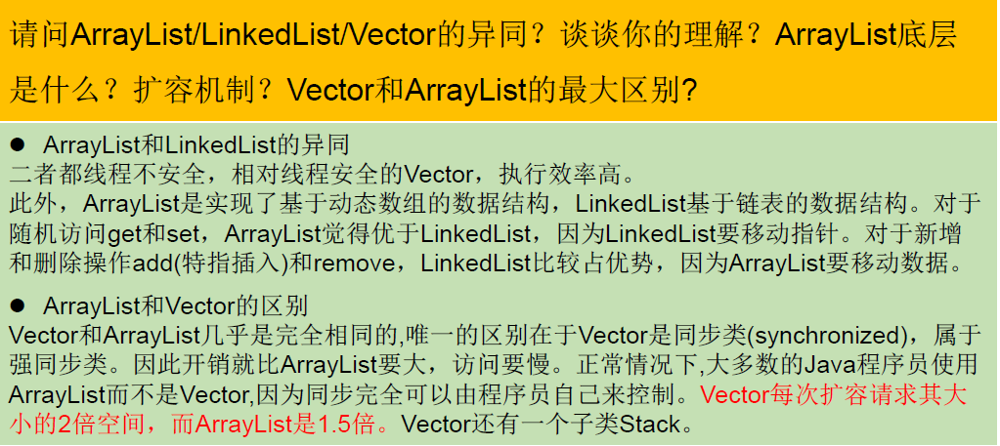
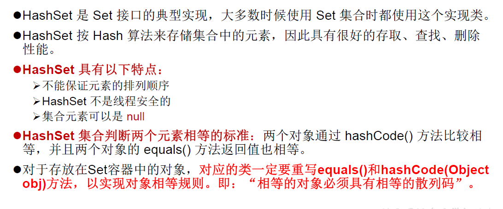

[TOC]


### 1、数组复习

#### 1.1数组的静态动态初始化

```java
public static void main(String[] args) {
        //数组的静态初始化
        int[] arrays = new int[]{1,2,3};
        System.out.println(Arrays.toString(arrays));
        //动态初始化
        int[] arrays1 = new int[4];
        arrays1[3] = 7;
        System.out.println(Arrays.toString(arrays1));
    }
    //输出：[1, 2, 3]
    //     [0, 0, 0, 7]
```

#### 1.2数组元素的默认初始化值


#### 1.3内存分析


#### 1.4二维数组的内存分析


#### 1.5常见Arrays工具类方法


### 2、面向对象编程

#### 1.1基本概述


#### 1.2对象的创建与使用：内存


#### 1.3成员变量与局部变量


#### 1.4方法重载


#### 1.5jdk包分布


#### 1.6子类与父类


#### 1.7this与super


#### 1.8对象的强制转换


#### 1.9==与equals区别


#### 1.10代码块


### 3、异常

#### 3.1异常与错误


### 4、常用类

#### 4.1String


`StringBuffer传入构造器的String不能为空`

#### 4.2Date


##### 4.2.1LocalDate、LocalTime、LocalDateTime


> 查找接口的实现类：
>
> IDEA 风格 ctrl + alt +B

#### 4.3System


#### 4.4Math


##### 4.4.1BigInteger


##### 4.4.2BigDecimal


### 5、枚举与注解

#### 5.1枚举


#### 5.2注解

##### 5.1.1 自定义注解


##### 5.1.2 元注解


##### 5.1.3 Java的可重复注解


### 6、集合

#### 6.1 迭代器




#### 6.2 vector、ArrayList、LinkedList



#### 6.3 hashset



